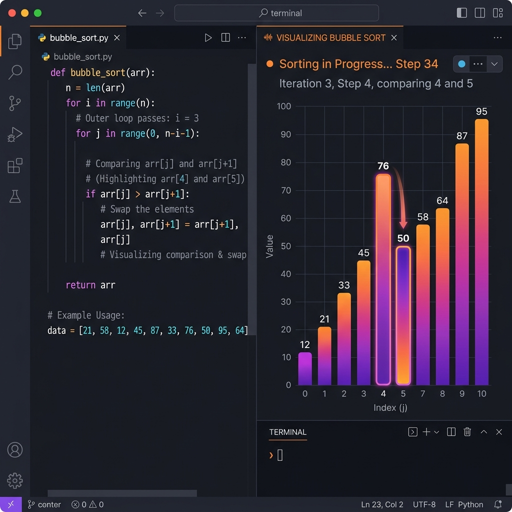

# 🚀 Python Sorting Methods: Array Visualizations

A comprehensive collection of fundamental sorting algorithms implemented in Python. This repository provides clean, readable, and educational implementations of various sorting techniques to help developers understand data structures and algorithmic efficiency.



## 📋 Table of Contents
- [About the Project](#about-the-project)
- [Implemented Algorithms](#implemented-algorithms)
- [Getting Started](#getting-started)
- [License](#license)
- [Acknowledgments](#acknowledgments)

## ✨ About the Project
Sorting is a fundamental concept in computer science. This project serves as a practical guide to implementing classic sorting algorithms in Python. Originally conceived in 2022 and refined for professional standards in 2026, it offers a hands-on approach to learning how arrays are manipulated and organized.

## 🛠️ Implemented Algorithms
The following sorting methods are currently available:

1.  **Bubble Sort**: A simple comparison-based algorithm that repeatedly steps through the list.
2.  **Insertion Sort**: Builds the final sorted array one item at a time.
3.  **Merge Sort**: An efficient, stable, divide-and-conquer algorithm.
4.  **Selection Sort**: An in-place comparison sorting algorithm that divides the input into two parts: sorted and unsorted.

## 🚀 Getting Started

### Prerequisites
- Python 3.x installed on your machine.

### Installation
1. Clone the repository:
   ```bash
   git clone https://github.com/rajjitlai/python-sorting-methods-array.git
   ```
2. Navigate to the desired algorithm directory:
   ```bash
   cd bubble-sort
   ```
3. Run the script:
   ```bash
   python bubSort.py
   ```


---

## 📄 License
Distributed under the MIT License. See `LICENSE` for more information.

Copyright &copy; 2026 **Rajjit Laishram**. All rights reserved.
_Originally created in 2022._

## 🙏 Acknowledgments
- Inspired by classic computer science curricula.
- Developed for educational purposes and algorithmic exploration.

---
<p align="center">Made with ❤️ for the Developer Community</p>